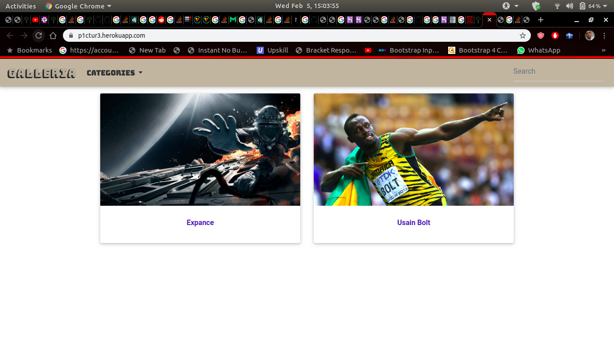

# GALLERIA
This is a web application that is built using Django. It is a photo galary where images have been showcased and various information about them given.

## Author
Moses Wamakima

## BDD
| Behaviour     |  Input          | Output        |
| :-----------: |:---------------:| :-----------: |
|Filter by category/location|Category/Location name|The images that fit filter description will be displayed|
|Display image  details|Click on desired image|Information about the the image will be displayed, i.e, the location, category and a brief descrption of the image.|

## Technologies Used
- Django
- Python 3.6
- HTML/CSS
- Bootstrap (MDB bootstrap)

## Screenshots

## Setup Requirements
- Python 3.6
- Internet Connection
- Run the following commands on your terminal:
`$ git clone https://github.com/wamakimaN/galeria.git`
- Navigate to the folder
 `$ cd <folder/file name>`
- To run the application;
 `$ python3.6 manage.py runserver`

## Known Bugs
The filter links disappear when you select a category.
For any other bugs identified, feel free to contact me.

## Contacts
wamamoses@gmail.com

## License
MIT Licence (c) Moses Wamakima 2020
